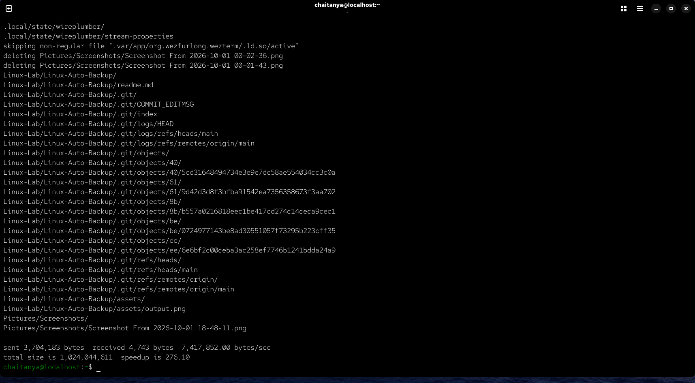
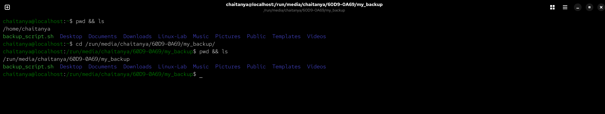

# Automated Linux File Backup System

### How It Works



The script automatically runs at a scheduled time using `cron`. Before starting, it checks whether the backup drive is properly mounted. If the drive is missing, the script stops to prevent accidental writes to the main system.

If the drive is available, `rsync` compares the source and backup directories and transfers only new or modified files. With `--delete`, files removed from the source are also removed from the backup, keeping both directories synchronized.

The entire process runs automatically in the background with no manual intervention.




## Features

* **Incremental Backups:** Uses `rsync` to only transfer files that have changed, saving time and compute resources.
* **Exact Mirroring:** Automatically deletes files on the backup drive if they are removed from the source, maintaining a 1:1 state.
* **Safety Checks:** Verifies the external drive is actively mounted before execution to prevent root partition flooding.
* **Background Automation:** Managed entirely by `cron` to run silently without manual intervention.

##  Technologies Used

* **Bash / Shell Scripting:** Logic and execution.
* **rsync:** The core data synchronization engine.
* **cron:** Time-based job scheduler.
* **Linux Filesystem:** Management of mount points and partition targeting.

## Installation & Setup

1. **Identify the Backup Drive:**
   Locate your external drive partition using `lsblk` and ensure it is mounted.

2. **Clone the Repository:**
Open your terminal and download the script to your system:
```bash
git@github.com:ChaitanyaBolake/Linux-Auto-Backup.git
```
4. **Configure the Script:**
Open backup_script.sh in any text editor (like nano or vim):
```bash
nano backup_script.sh 
```
Update the top three variables to match your system:

SOURCE: The folder you are backing up (e.g., /home/username/). Keep the trailing slash.

DESTINATION: The folder on your external drive (e.g., /run/media/username/drive-id/my_backup/).

MOUNT_CHECK: The parent directory of your external drive to ensure it is plugged in before running.

4. **Make the Script Executable:**
Grant the file permission to run as a program:
```bash
chmod +x backup_script.sh
```
5.**Automate the Schedule (Cron):**
Tell your system to run this script automatically in the background. Type this command directly into your terminal:
```bash
crontab -e
```
This will open your user schedule file. Scroll to the very bottom and paste the following line to run the backup every day at 2:00 AM:
```bash
0 2 * * * /path/to/linux-auto-backup/backup_script.sh > /dev/null 2>&1
```

(Note: Replace /path/to/linux-auto-backup/... with the actual absolute path to where you saved the script. Save and exit the editor to activate the schedule).
